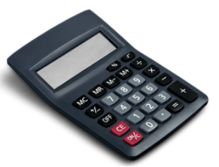
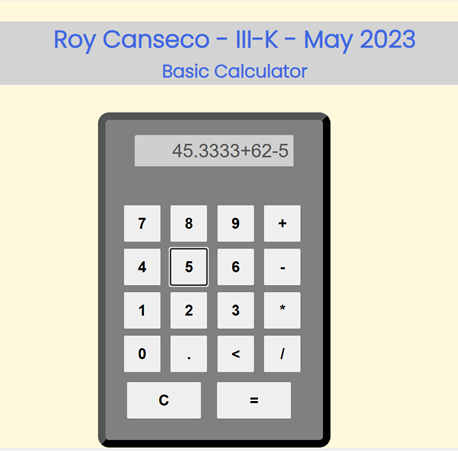

# Basic Calculator

Today we shall create the beginnings of a calculator program. It shall have the following abilities/buttons:

    1. add
    2. subtract
    3. multiply
    4. divide
    5. backspace
    6. equal sign
    7. numerical keys
    8. decimal point
    9. reset or C button

**Note:** 

* All numerical outputs should have a maximum of 3 decimal places.
* All inputs are expected to be floats.

## Sample Screen and Run (user enters a formula by clicking on the appropriate buttons)

## Sample Screen and Run (user clicks on = sign)

## Practice Self-learning part
 - Research and use the **`eval()`** native function of JS to help you solve the calculator requirement.
 - **substring()** string native function of JS to be applied on the backspace key.
 - Research and use the CSS property **`border-radius`**, to have a rounded corner calculator.

## Procedure
1. Develop your index.html, with meta tags and appropriate favicon for this exercise.
2. Create a calculator UI based on the sample above, all centered on the screen.
3. Apply learned box model CSS properties and also the CSS position (Q2 W2 topic discussion). **border-radius** should be used in this exercise to have a rounded corner for the calculator.
4. All CSS should be inside an external stylesheet.
5. Control the foregroud and backgroud color.  This would be up to you.
6. Change the font-family used in this exercise. This would be up to you.  You can refer to this site https://fonts.google.com/ for more font-family options.
7. Code your javascript solution and page content in `script.js`.
    - Numbers and operators when clicked should be displayed on the textbox as concatenated string.
    - When user clicks on the = button, the result of the formula should be displayed. Use the **eval()** here.
    - When user clicks on the backspace < button, the textbox should shorten from the right side. Use the **substring()** here.
    - When user clicks on the C button the textbox content will be erased and value will start from 0.
 
## Q1 Grading (30pts)
 - **50% javascript program (15points)**
   - defining onclick functions for each of the button
   - constructing the content on the text box as user clicks on the numeric and operator buttons
   - getting and showing the result on the text box at press of the = button and displayed with three decimal places.
   - backspacing button on the calculator is working
   - reset button (C) is working.
     
 - **30% user interface (9pts)**
   - two headings are visible on the screen with your name, section and date.  It is centered with a different foreground and background color.
   - the calculator is also horizontally centered on the screen
   - textbox, buttons are sized and positioned appropriately
   - use border-radius and border on the displayed calculator
   - font-family was changed.
   - overall look is pleasing to the eyes
     
 - **20% overall organization (6pts)**
   - proper embedding of tags and proper indentation of code.
   - title and meta tags are present and have appropriate contents (2pts)
   - comments on the JS Code
   - comments on the CSS

## Due Date and Cut-off Date
Feb 14, 2024 **`submissions beyond Dec 1 until Dec 6 will be scored with a cap of 80%. No more submission beyond Dec. 6`**

---
